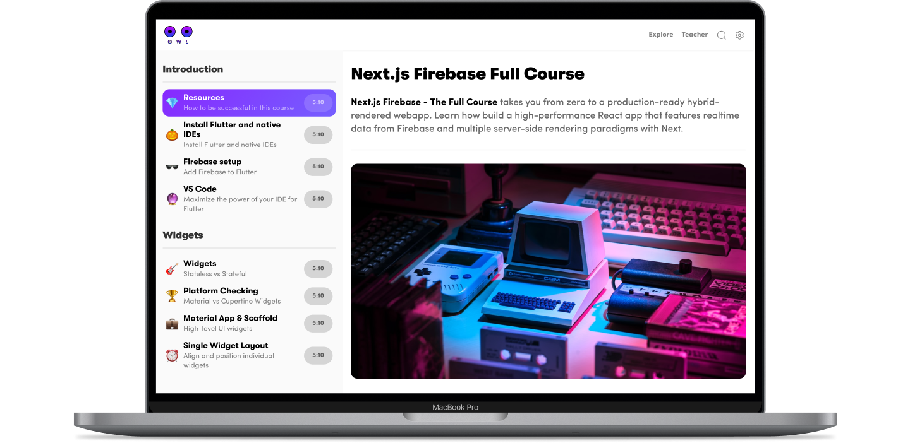
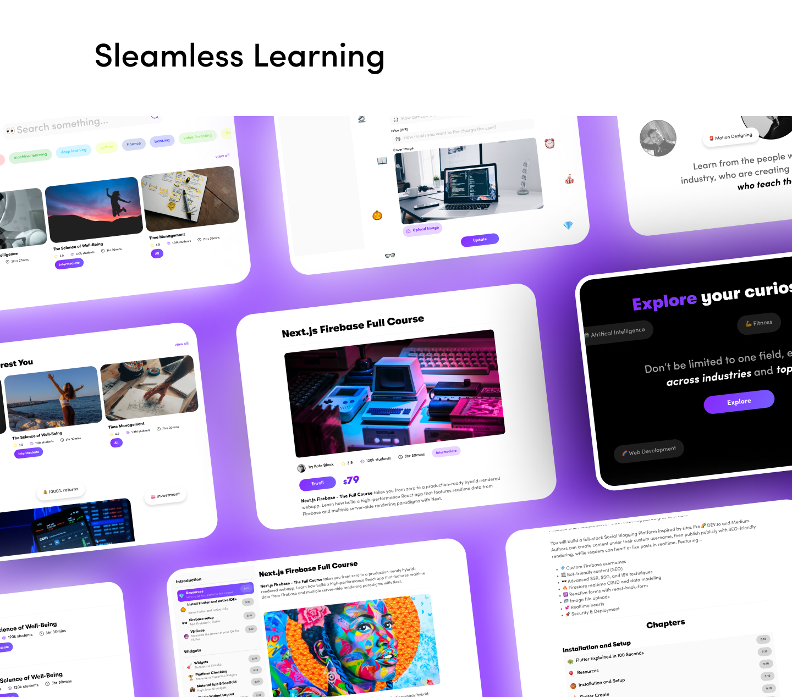
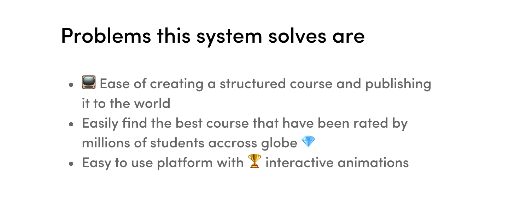
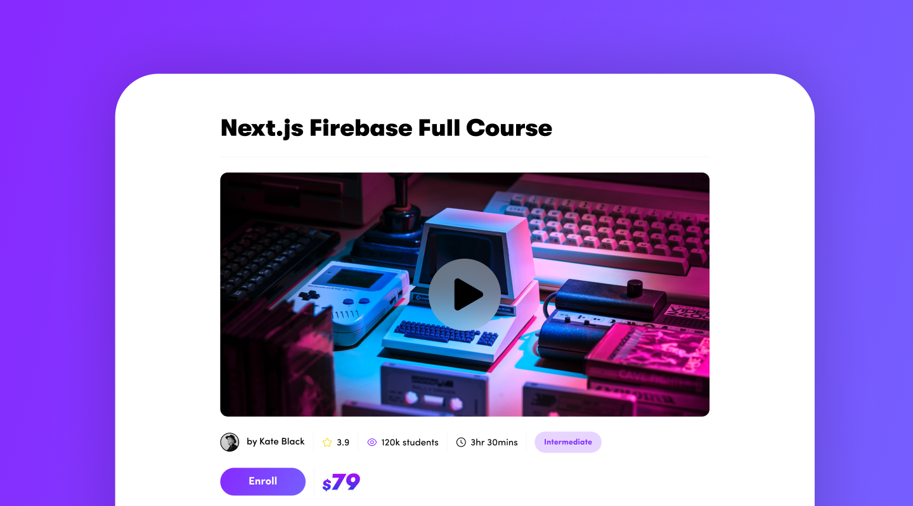
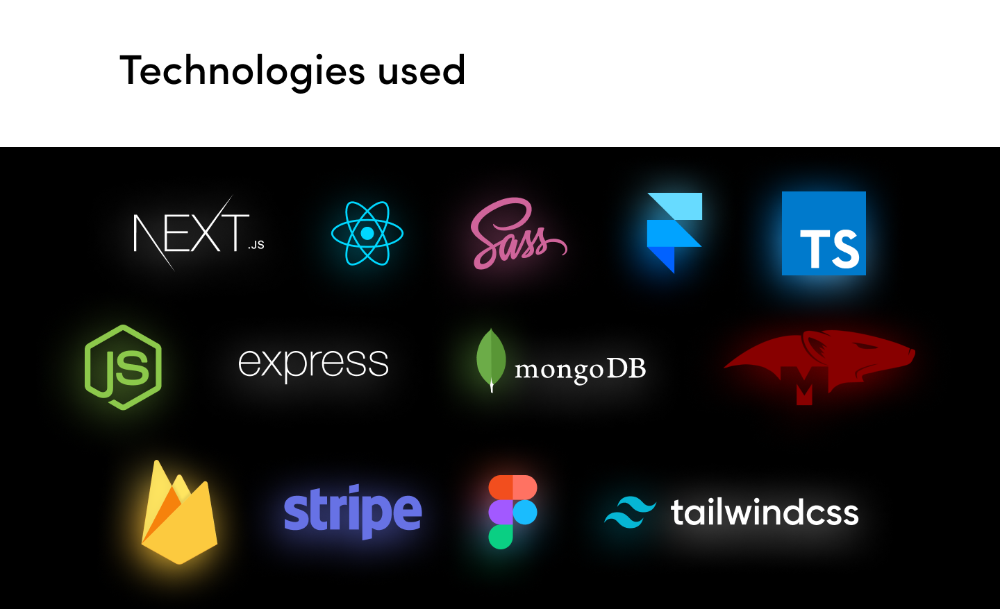
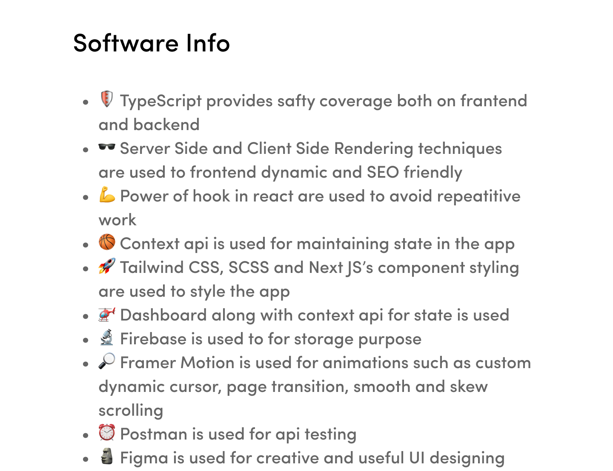

## Todo

- Add way to order lessons and chapters
- Add feedback in frontend
- Create explore and search pages
- Make course purchase in frontend
- Create settings, profile, my purchased courses and payment info pages
- Add course learning view for users who purchased the course
- Solve white space issue created by increase in height by SmoothScrolling component
- Create generic form fields
- Create more hooks for DRYing the code
- Update types of rendering method in pages as per need
- Add gifs of app in action
- Add get started section in README.md

## Licence

[MIT](./LICENSE)
